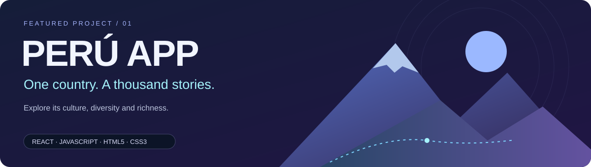
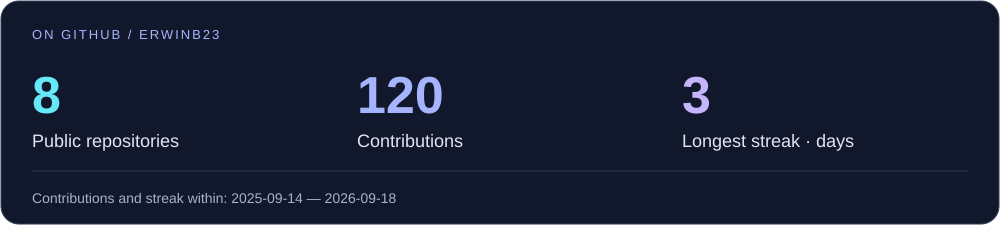
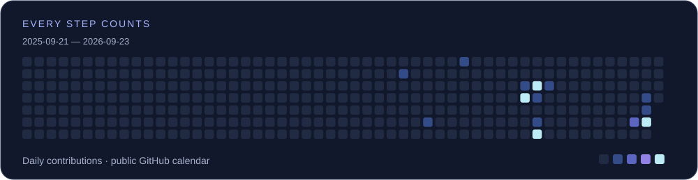
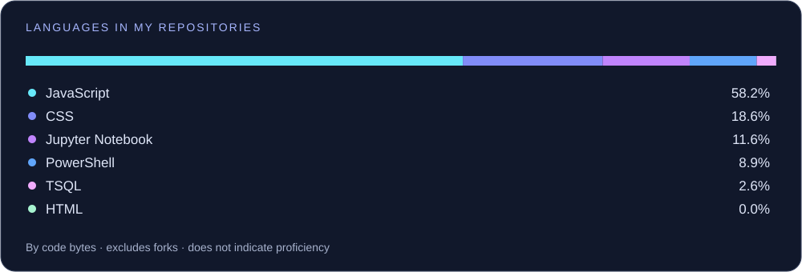

  <a href="README.md">Español</a> · <strong>EN</strong>

<picture>
  <source media="(max-width: 600px)" srcset="assets/header-mobile-en.svg" />
  
</picture>

  <strong>Systems Engineering student · Web &amp; mobile developer</strong> 
  Passionate about technology, continuous learning and the possibilities of artificial intelligence.

  
  
  

## 01 / About me

I enjoy turning ideas into applications that are useful and enjoyable to use. I'm **Erwin**, a Systems Engineering student currently learning and building **web and mobile applications** by bringing together code, design and artificial intelligence.

- **Right now:** deepening my knowledge of React, React Native and Expo to build for the web and Android; I have also worked with Flutter.
- **How I work:** using agents and skills to support development, review and testing.
- **Quality from the start:** working with specifications, tests and automation through SDD, TDD and CI/CD with GitHub.
- **What drives me:** continuous learning and turning what I learn into real projects.

**Languages:** Spanish · intermediate English.

## 02 / My stack

**Languages I use**

  
  
  

**Web development**

  
  
  
  

**Mobile &amp; cross-platform development**

  
  
  

I use Expo Go for testing on Android and Expo to work on the web as well.

**Data, services &amp; version control**

  
  
  
  
  
  

## 03 / AI, agents &amp; quality

I integrate AI tools into my development workflow and work with **agents, skills, specifications and tests** to structure ideas and review the results.

  
  
  
  
  
  
  
  

<strong>Explore my workflow ↗</strong>

- **Agents and skills:** organizing tasks and reusable instructions to support development.
- **SDD · specification-driven development:** defining what to build before implementation, with workflows such as Specify.
- **TDD · test-driven development:** defining expected behavior, implementing and refactoring.
- **Quality and CI/CD:** testing and automating checks and integration with GitHub.
- **Human judgment:** reviewing and validating AI-assisted code.

## 04 / Featured project

### Peru App

A web application to discover Peru and explore its richness, culture and diversity. This project brings together my interest in web development and the opportunity to introduce more people to the country.

**React · JavaScript · HTML5 · CSS3**

  
  

## 05 / Code in motion

<strong>Activity and repository languages ↗</strong>

The distribution reflects code in my public repositories, not proficiency. It includes markup languages and notebooks when detected by GitHub.

<strong>My activity, snake edition ↗</strong>

## 06 / Let's connect

Interested in my work? Explore my projects or get in touch. There is always something new to learn and build.

  
  
  
  
  <!-- TIKTOK: replace the following badge with a link when your URL is ready. -->
  

  

