

  <strong>ES</strong> · <a href="README.en.md">English</a>

<picture>
  <source media="(max-width: 600px)" srcset="assets/header-mobile-es.svg" />
  
</picture>

  <strong>Estudiante de Ingeniería de Sistemas · Desarrollador web y móvil</strong> 
  Apasionado por la tecnología, el aprendizaje continuo y las posibilidades de la inteligencia artificial.

  
  
  

## 01 / Sobre mí

Me gusta convertir ideas en aplicaciones que sean útiles y agradables de usar. Soy **Erwin**, estudiante de Ingeniería de Sistemas: actualmente aprendo y desarrollo aplicaciones **web y móviles**, combinando código, diseño e inteligencia artificial.

- **Ahora:** profundizando en React, React Native y Expo para crear experiencias en web y Android; también he trabajado con Flutter.
- **Mi forma de trabajar:** utilizar agentes y skills como apoyo para desarrollar, revisar y probar soluciones.
- **Calidad desde el inicio:** trabajar con especificaciones, pruebas y automatización mediante SDD, TDD y CI/CD con GitHub.
- **Lo que me mueve:** seguir aprendiendo y transformar lo que aprendo en proyectos reales.

**Idiomas:** español · inglés intermedio.

## 02 / Mi stack

**Lenguajes que utilizo**

  
  
  

**Desarrollo web**

  
  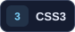
  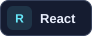
  

**Desarrollo móvil y multiplataforma**

  
  
  

Uso Expo Go para probar en Android y Expo para trabajar también en web.

**Datos, servicios y control de versiones**

  
  
  
  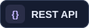
  
  

## 03 / IA, agentes y calidad

Integro herramientas de inteligencia artificial en mi flujo de desarrollo y trabajo con **agentes, skills, especificaciones y pruebas** para dar estructura a las ideas y revisar los resultados.

  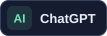
  
  
  
  
  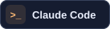
  
  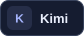

<strong>Explora mi forma de trabajar ↗</strong>

- **Agentes y skills:** organización de tareas e instrucciones reutilizables para apoyar el desarrollo.
- **SDD · desarrollo guiado por especificaciones:** definir qué construir antes de implementar; trabajo con flujos como Specify.
- **TDD · desarrollo guiado por pruebas:** plantear el comportamiento esperado, implementar y refactorizar.
- **Calidad y CI/CD:** pruebas y automatización de verificaciones e integración con GitHub.
- **Criterio propio:** revisar y comprobar el código producido con asistencia de IA.

## 04 / Proyecto destacado

<a href="https://peru-app-frontend.vercel.app">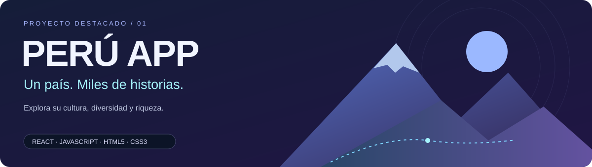</a>

### Peru App

Una aplicación web para conocer el Perú y explorar su riqueza, cultura y diversidad. Un proyecto donde combino mi interés por el desarrollo web con la posibilidad de acercar el país a más personas.

**React · JavaScript · HTML5 · CSS3**

  
  

## 05 / Código en movimiento

<a href="https://github.com/ErwinB23?tab=repositories">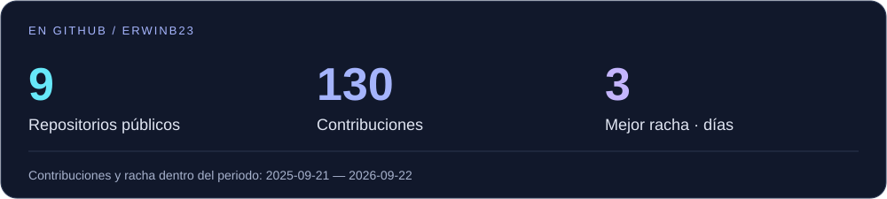</a>

<strong>Actividad y lenguajes en mis repositorios ↗</strong>

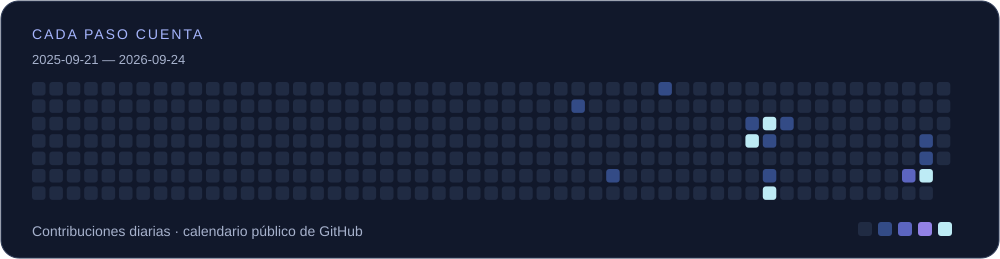

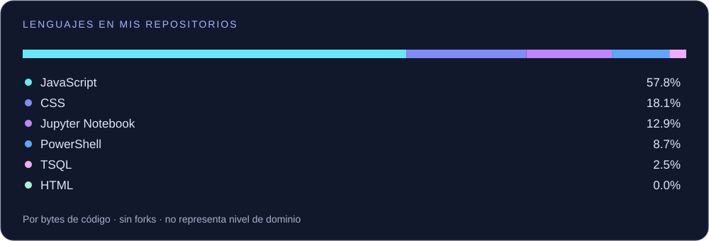

La distribución refleja el código de mis repositorios públicos, no mi nivel de dominio. Incluye lenguajes de marcado y notebooks cuando GitHub los detecta.

<strong>Mi actividad, en versión snake ↗</strong>

## 06 / Conectemos

¿Te interesa mi trabajo? Explora mis proyectos o escríbeme. Siempre hay algo nuevo por aprender y construir.

  
  
  
  
  

  

